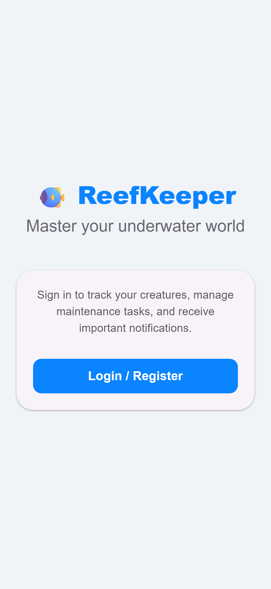
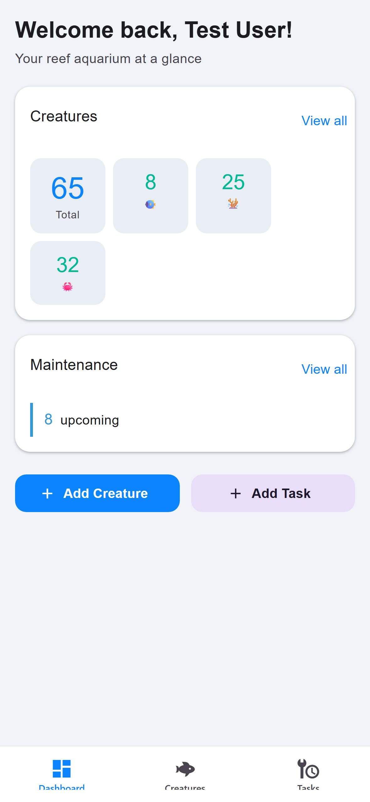
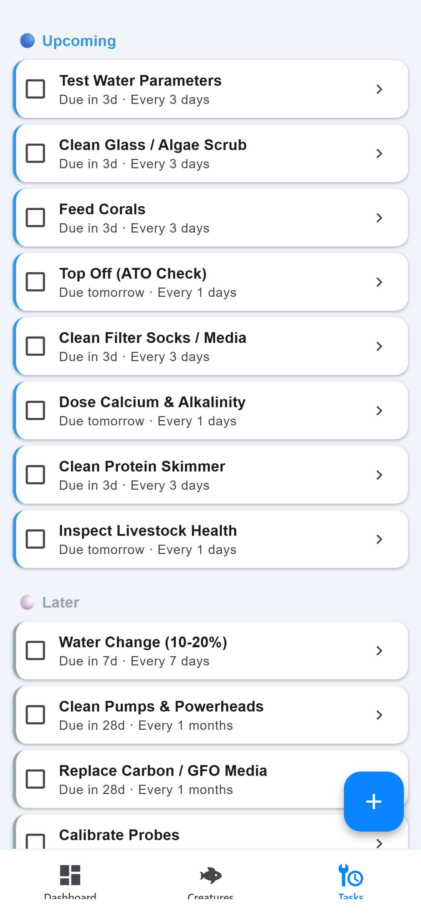

# 🐠 ReefKeeper

A cross-platform mobile app for reef aquarium hobbyists to track creatures, manage recurring maintenance tasks, and stay on top of their tank care — built with **React Native**, **Expo**, and **TypeScript**.

<p align="center">
  
  
  
  
</p>

---

## Features

- **Dashboard** — at-a-glance view of your tank: creature counts, overdue/upcoming tasks, and quick actions
- **Creature Registry** — catalog your fish, corals, invertebrates and more with photos, species info, and health logs
- **Maintenance Tasks** — recurring and one-off task management with automatic rescheduling (water changes, parameter tests, feeding, etc.)
- **Notifications** — configurable reminders before tasks are due
- **Search & Filter** — find creatures by name, species, or type
- **Dark Mode** — automatic theme based on system preference
- **Auth0 Authentication** — secure login/registration
- **Offline-first** — all data stored locally via AsyncStorage

## Tech Stack

| Layer | Technology |
|-------|-----------|
| Framework | [Expo](https://expo.dev) (SDK 54) + [Expo Router](https://docs.expo.dev/router/introduction/) |
| Language | TypeScript |
| UI | [React Native Paper](https://reactnativepaper.com/) (Material Design 3) |
| Auth | [Auth0](https://auth0.com/) via `react-native-auth0` |
| Storage | `@react-native-async-storage/async-storage` |
| Unit Tests | Jest + React Testing Library |
| E2E Tests | [Playwright](https://playwright.dev/) |
| CI/CD | GitHub Actions |

---

## Getting Started

### Prerequisites

- **Node.js** 20+
- **npm** 10+
- An [Auth0](https://auth0.com/) account (for authentication)

### Installation

```bash
# Clone the repository
git clone https://github.com/<your-org>/ReefKeeper.git
cd ReefKeeper

# Install dependencies
npm install
```

### Environment Variables

Copy the example env file and fill in your Auth0 credentials:

```bash
cp .env.example .env
```

| Variable | Description |
|----------|-------------|
| `AUTH0_DOMAIN` | Your Auth0 tenant domain |
| `AUTH0_CLIENT_ID` | Auth0 application client ID (for web/iOS) |
| `AUTH0_CLIENT_ID_APK` | Auth0 application client ID for Android (optional, defaults to AUTH0_CLIENT_ID) |
| `AUTH0_CLIENT_SECRET` | Auth0 application client secret |
| `AUTH0_CALLBACK_URL` | OAuth callback URL (`http://localhost:8081` for local dev) |
| `TEST_USER_EMAIL` | Email for the E2E test user |
| `TEST_USER_PASSWORD` | Password for the E2E test user |

### Auth0 Configuration

For Android authentication to work properly, you need to configure the following URLs in your Auth0 application settings:

**Allowed Callback URLs:**
```
reef-keeper://{yourDomain}/android/com.reefkeeper.app/callback
http://localhost:8081
```

**Allowed Logout URLs:**
```
reef-keeper://{yourDomain}/android/com.reefkeeper.app/callback
http://localhost:8081
```

Replace `{yourDomain}` with your actual Auth0 domain (e.g., `reefkeeper.eu.auth0.com`).

**Note:** The Android package name is `com.reefkeeper.app` and the custom scheme is `reef-keeper`.

### Running the App

```bash
# Start in web mode
npx expo start --web

# Start for iOS (requires macOS + Xcode)
npx expo start --ios

# Start for Android (requires Android Studio)
npx expo start --android
```

The app will be available at **http://localhost:8081**.

---

## Testing

### Unit Tests

```bash
npm test
```

Runs Jest tests located in `__tests__/`. The configuration is in `jest.config.js`.

### End-to-End Tests

Playwright tests live in `e2e/` and run against the web build.

```bash
# Install Playwright browsers (first time only)
npx playwright install chromium

# Run E2E tests (auto-starts the dev server)
npx playwright test

# Run with visible browser
npx playwright test --headed

# View the last test report
npx playwright show-report
```

---

## Project Structure

```
ReefKeeper/
├── app/                    # Expo Router screens
│   ├── (tabs)/             # Tab navigator (Dashboard, Creatures, Tasks)
│   ├── creature/           # Creature detail & add screens
│   ├── task/               # Task detail & add screens
│   ├── settings.tsx        # Settings screen
│   └── _layout.tsx         # Root layout (Auth0 provider, theme)
├── components/             # Reusable UI components
├── constants/              # Theme colors, creature types, default tasks
├── hooks/                  # Custom React hooks (useCreatures, useTasks, etc.)
├── models/                 # TypeScript interfaces (Creature, Task)
├── services/               # Data layer (AsyncStorage CRUD, notifications)
├── e2e/                    # Playwright E2E tests (web)
├── maestro/                # Maestro UI tests (Android)
├── __tests__/              # Jest unit tests
├── .github/workflows/      # CI/CD pipeline
└── docs/screenshots/       # App screenshots
```

---

## Contributing

1. **Fork** the repository
2. **Create a branch** for your feature or fix:
   ```bash
   git checkout -b feature/my-feature
   ```
3. **Make your changes** — follow the existing code style (TypeScript strict mode, functional components, hooks)
4. **Run checks** before committing:
   ```bash
   npx tsc --noEmit        # Type-check
   npm test                 # Unit tests
   npx playwright test      # E2E tests
   ```
5. **Commit** with a clear message and **open a Pull Request**

The CI pipeline will automatically run type-checking, unit tests, a web build, and Playwright E2E tests on every PR.

### Code Conventions

- **Functional components** with hooks — no class components
- **TypeScript strict mode** — no `any` unless absolutely necessary
- **React Native Paper** for all UI elements — follow Material Design 3 patterns
- **AsyncStorage** for persistence — all keys prefixed with `@reef_keeper`
- **Expo Router** file-based routing — screens go in `app/`

---

## CI/CD

The GitHub Actions workflows run on every push and PR to `main`:

### Web Pipeline (`.github/workflows/build.yml`)

| Job | Steps |
|-----|-------|
| **build-and-test** | Install deps → TypeScript check → Unit tests → Expo web export |
| **e2e** | Install deps → Install Playwright → Run E2E tests → Upload report artifact |

### Android Pipeline (`.github/workflows/android.yml`)

| Job | Steps |
|-----|-------|
| **android-build** | Install deps → Expo prebuild → Gradle build → Upload debug APK |
| **android-test** | Build APK → Start Android emulator → Install APK → Run Maestro UI tests → Upload report |

---

## License

This project is private. All rights reserved.
